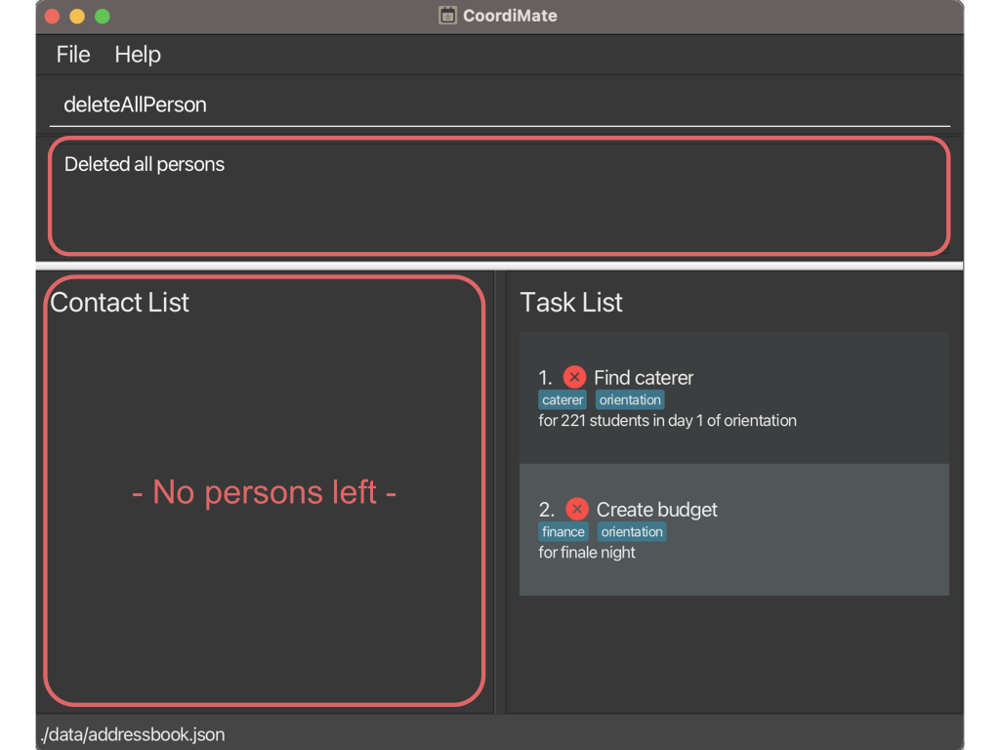
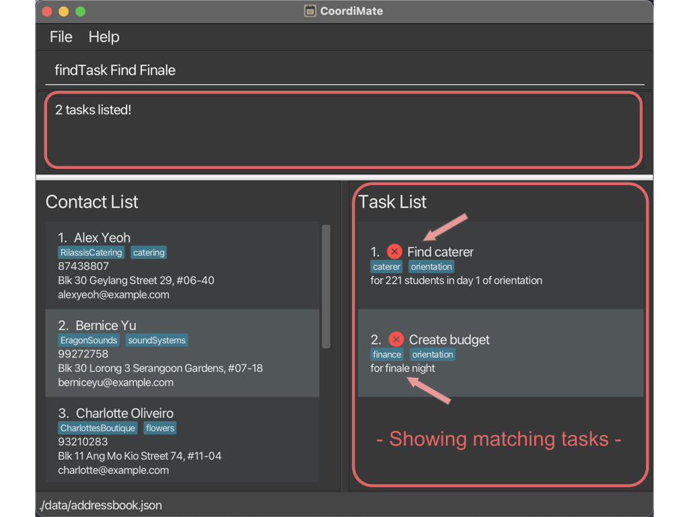
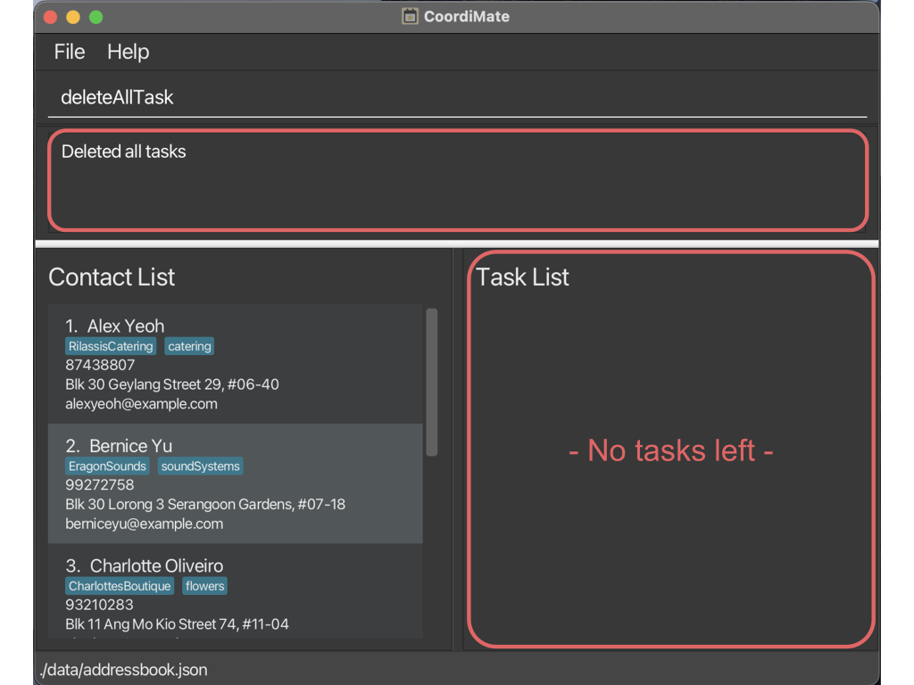
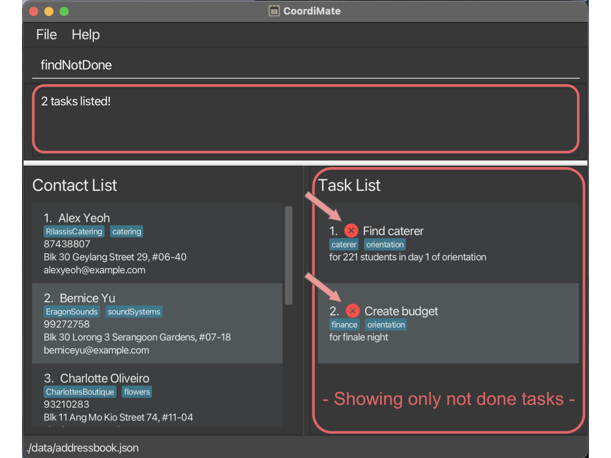
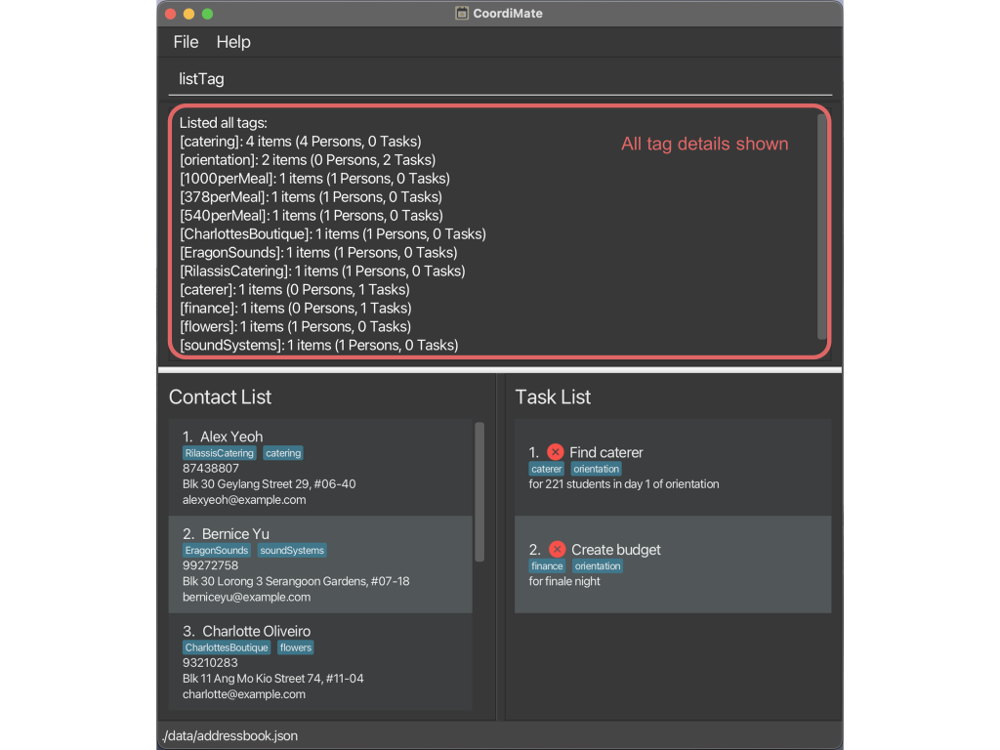

Do you have trouble managing contacts?

Don't worry, CoordiMate is here to help!

CoordiMate is a **desktop app for event planners**. It helps you **manage your contacts and tasks** for your events, so that you can focus on the event itself.

CoordiMate is **optimized for use via a Command Line Interface (CLI)** while still having the benefits of a Graphical User Interface (GUI).

If you can type fast, CoordiMate can help you get your contact management tasks done **faster than traditional GUI apps**.

This user guide contains all the information you need to get started with CoordiMate.

## Using This Guide

This document will guide you on the various features of CoordiMate and how to use them.

If you are a new user, we recommend that you read this guide starting from the [Quick Start](#quick-start) section.

If you are an advanced user, you can use the [Table of Contents](#table-of-contents) below to quickly locate the relevant section. Alternatively, you can jump to the [Command Summary](#command-summary) section for an overview of the command syntax.

Here are some annotations used in this guide:











Throughout this guide, you will see different text styles that are used to highlight important information.

- <a href="javascript: void(0)">Text in blue</a> are links which you can click on to jump to the relevant section.
- `Text with light blue background` are commands or file names which are used for CoordiMate.

<div style="page-break-after: always;"></div>

---

## Table of Contents

- Table of Contents
{:toc}

---

<div style="page-break-after: always;"></div>

## Quick start

1. Ensure you have Java `11` or above installed in your Computer.

2. Download the latest `CoordiMate.jar` from [here](https://github.com/AY2324S1-CS2103T-T10-2/tp/releases).

3. Copy `CoordiMate.jar` to the folder you want to use as the _home folder_ for CoordiMate. This folder will be used by CoordiMate to store its data.

4. Open a command terminal, `cd` into the folder you put `CoordiMate.jar` in, and use the `java -jar CoordiMate.jar` command to start CoordiMate.<br>

   A GUI similar to the below picture should appear in a few seconds. Note how the app contains some sample data.<br>
   

5. Type the command in the command box and press Enter to execute it. e.g. typing **`help`** and pressing Enter will open the help window.<br>
   Some example commands you can try:

   * `listPerson` : Lists all persons.

   * `addPerson n/John Doe p/98765432 e/johnd@example.com a/John street, block 123, #01-01` : Adds a new contact named `John Doe` with the specified details.

   * `deletePerson 3` : Deletes the 3rd contact shown in the current contact list.

   * `findTask Get` : Finds all tasks with the word `caterer` in their title or note.

   * `listTask` : Lists all tasks.

   * `addTask T/Get Flowers n/Wedding Anniversary` : Adds a task titled `Get Flowers` with note `Wedding Anniversary` to the task list.

   * `markTask 1` : Marks the 1st task shown in the current task list as done.

   * `exit` : Exits the app.

6. Refer to the [Usage](#usage) section below for details of each command.

---

<div style="page-break-after: always;"></div>

## Features

1. Create, Read, Update, Delete (CRUD) Person
2. Find Person
3. CRUD Task
4. Find Task
5. Automatic saving and loading of data from save file
    1. CoordiMate automatically saves its data as a JSON file located at `[JAR file location]/data/CoordiMate.json`.
    2. There is no need to save manually.
    3. On startup, CoordiMate will automatically load existing data (if any) from the JSON file.
6. Editable file format
   1. Advanced users are welcome to update data directly by editing that data file.



---

<div style="page-break-after: always;"></div>

## Usage

{% include admonition.html type="note" title="Note: About Command Formats" body="

<ul>
  <li>
    <p>
      Words in <code>UPPER_CASE</code> are the parameters to be supplied by the user.<br>
      e.g. in <code>addPerson n/NAME</code>, <code>NAME</code> is a parameter which can be used as <code>addPerson n/John Doe</code>, where <code>John Doe</code> is the value of the parameter <code>NAME</code>. <br>
    </p>
  </li>

  <li>
    <p>
      Items in square brackets are optional.<br>
      e.g <code>n/NAME [t/TAG]</code> can be used as <code>n/John Doe t/friend</code> or as <code>n/John Doe</code>.<br>
      Note that the square brackets (<code>[</code> and <code>]</code>) are not part of the syntax.
    </p>
  </li>

  <li>
    <p>
      Items in square brackets with <code>…</code> after them can be used multiple times, including zero times.<br>
      e.g. <code>[t/TAG]…​</code> can be used as <code> </code> (i.e. 0 times), <code>t/friend</code>, <code>t/friend t/family</code> etc.
    </p>
  </li>

  <li>
    <p>
      Parameters can be in any order.<br>
      e.g. if the command specifies <code>n/NAME p/PHONE_NUMBER</code>, <code>p/PHONE_NUMBER n/NAME</code> is also acceptable.
    </p>
  </li>

  <li>
    <p>
      Extraneous parameters for commands that do not take in parameters (such as <code>help</code>, <code>listPerson</code>, <code>deleteAllPerson</code>, <code>listTask</code>, <code>deleteAllTask</code> and <code>exit</code>) will be ignored.<br>
      e.g. if the command specifies <code>help 123</code>, it will be interpreted as <code>help</code>.
    </p>
  </li>
</ul>

" %}



<div style="page-break-after: always;"></div>

### 1. Viewing help: `help`

You can view a link to access the user guide at any time, ensuring that you will never be lost.

<h4>Format:</h4>

```
help
```

<h4>Examples:</h4>

- `help`
  - Opens a window with a link to our user guide. You can copy the URL into a browser, or click on the "Open in browser" button to access the user guide directly.

  

<div style="page-break-after: always;"></div>

### 2. Adding a person: `addPerson`

Add new people that you meet, be it new clients, vendors or friends.

Format:

```
addPerson n/NAME p/PHONE_NUMBER e/EMAIL a/ADDRESS [t/TAG]…
```



Examples:

- `addPerson n/John Doe p/98765432 e/johnd@example.com a/John street, block 123, #01-01`
- `addPerson n/Betsy Crowe t/friend e/betsycrowe@example.com a/Newgate Prison p/1234567 t/criminal`

Output:


Errors:


<div style="page-break-after: always;"></div>

### 3. Listing all persons: `listPerson`

Presents you with a comprehensive list of contacts in your contact list.

Format:

```
listPerson
```

Examples:

- `listPerson`

Output:


<div style="page-break-after: always;"></div>

### 4. Editing a person: `editPerson`

Enables you to change the details or particulars of an existing contact in your contact list.

Format:

```
editPerson INDEX [n/NAME] [p/PHONE] [e/EMAIL] [a/ADDRESS] [t/TAG]…
```

- Edits the person at the specified `INDEX`. The index refers to the index number shown in the displayed person list. The index **_must be a positive integer_** 1, 2, 3, …
- At least one of the optional fields must be provided.
- Existing values will be updated to the input values.
- When editing tags, the existing tags of the person will be removed i.e adding of tags is not cumulative.
- You can remove all the person’s tags by typing `t/` without specifying any tags after it.

Examples:

- `editPerson 1 p/91234567 e/johndoe@example.com` Edits the phone number and email address of the 1st person to be `91234567` and `johndoe@example.com` respectively.
- `editPerson 2 n/Betsy Crower t/` Edits the name of the 2nd person to be `Betsy Crower` and clears all existing tags.

Output:


Errors:

- Incorrect command format


- Missing fields


- Invalid index


<div style="page-break-after: always;"></div>

### 5. Finding a specific person: `findPerson`

Allows you to quickly find a specific person's details by their name.



Format:

```
findPerson KEYWORD [MORE_KEYWORDS]…
```

- At least one keyword is required to search.
- The search is case-insensitive. e.g `hans` will match `Hans`.
- The order of the keywords does not matter. e.g. `Hans Bo` will match `Bo Hans`.
- Only the **name** is searched.
- Only full words will be matched e.g. `Han` will not match `Hans`.
- Persons matching at least one keyword will be returned (i.e. `OR` search).
  - e.g. `Hans Bo` will match `Hans Gruber`, `Bo Yang`.

Examples:

- `findPerson alex yu`
  - Finds persons whose names contains either `alex` or `yu`.
- `findPerson David`
  - Finds persons whose name contains `David`.
- `findTask`
  - Negative example as no keywords are specified.

Output:

- The details of `Alex Yeoh` and `Bernice Yu` are displayed as they match the search criteria `alex yu`.




- No persons are displayed as no person matches the search criteria `David`.




Errors:

- No keywords are specified.




<div style="page-break-after: always;"></div>

### 6. Deleting a person entry: `deletePerson`



Erase an outdated person from your contact list with ease.

Format:

```
deletePerson INDEX
```

- Deletes the person at the specified `INDEX`.
- The index refers to the index number shown in the displayed person list.
- The index **_must be a positive integer_** 1, 2, 3, …

Examples:

- `listPerson` followed by `deletePerson 2` deletes the 2nd person in the contact list.
- `findPerson Betsy` followed by `deletePerson 1` deletes the 1st person in the results of the `findPerson` command.

Output:


Errors:


<div style="page-break-after: always;"></div>

### 7. Clearing all person entries: `deleteAllPerson`

Clears all contacts in your contact list.



<h4>Format:</h4>

```
deleteAllPerson
```

<h4>Examples:</h4>

- `deleteAllPerson`
  - Deletes all persons in your contact list.

  

<div style="page-break-after: always;"></div>

### 8. Adding a task: `addTask`

Adds a task to your task list.

<h4>Format:</h4>

```
addTask T/TITLE n/NOTE [t/TAG]...
```

<h4>Examples:</h4>

- `addTask T/Book rooms n/For day 2 t/orientation t/bookings`
  - Adds a task titled `Book rooms` with note `For day 2` and tags `orientation` and `bookings`.

  

- `addTask T/Call Caterers n/For 292 people t/orientation`
  - Adds a task titled `Call Caterers` with note `For 292 people` and tag `orientation`.
  
  

<h4>Errors:</h4>

- `addTask T/Book rooms`
  - Negative example as the note is not specified.
  

<div style="page-break-after: always;"></div>

### 9. Listing all tasks: `listTask`

Provides you with a complete list of tasks in your task list.

Format:

```
listTask
```

Examples:

- `listTask`

Output:


<div style="page-break-after: always;"></div>

### 10. Editing a task: `editTask`

You can edit the details of a task in your task list.

<h4>Format:</h4>

```
editTask INDEX [T/TITLE] [n/NOTE] [t/TAG]...
```

- Edits the task at the specified `INDEX`. The index refers to the index number shown in the task list currently displayed.
- Specify a new title with the `T/` prefix. This field is **optional**.
- Specify a new note with the `n/` prefix. This field is **optional**.
- Specify new tags with the `t/` prefix. This field is **optional**.
- At least one of the optional fields must be provided for the command to be valid.

<h4>Examples:</h4>

- `editTask 1 T/Find Caterer`
  - Edits the title of the 1st task to be `Find Caterer`.

  

- `editTask 2 T/Book room n/By Friday t/orientation`
  - Edits the title of the 2nd task to be `Book room`, the note to be `By Friday`, and the tag to be `orientation`.

  

<h4>Errors:</h4>

- `editTask`
  - Negative example as the index is not specified.

  

<div style="page-break-after: always;"></div>

### 11. Finding a specific task: `findTask`

You can quickly locate tasks that contains your specified keywords in their title and/or note.



Format:

```
findTask KEYWORD [MORE_KEYWORDS]…
```

- At least one keyword is required to search.
- The search is case-insensitive. e.g `find` will match `Find`.
- The order of the keywords does not matter. e.g. `Find Venue` will match `Venue Find`.
- Both the **title and note** of a task are searched.
- Only full words will be matched e.g. `Venue` will not match `Venues`.
- Tasks matching at least one keyword in either the title or the note will be returned (i.e. `OR` search).
  - e.g. `Budget Venue` will match `Find Venue`, `Create Budget`.

Examples:

- `findTask Find Finale`
  - Finds tasks with titles or notes containing either `Find` or `Finale`.
- `findTask Photography`
  - Finds tasks with titles or notes containing `Photography`.
- `findTask`
  - Negative example as no keywords are specified.

Output:

- Both tasks are displayed as Task 1 has the word `Find` in its title and Task 2 has the word `Finale` in its note.

  



- There are no tasks to be displayed, as no Task has the word `Photography` in its title or note.

  



Errors:

- No keywords are specified.

  



<div style="page-break-after: always;"></div>

### 12. Deleting a task entry: `deleteTask`



You can remove a task from your task list.

Format:

`deleteTask INDEX`

- Deletes the task at the specified `INDEX`.
- The index refers to the index number shown in the task list currently displayed.

Examples:

- `deleteTask 2`
  - Deletes the 2nd task in the task list.
- `findTask Call` followed by `deleteTask 1`
  - Deletes the 1st task in the results of the `findTask` command.

Output:

- Deletes task 2.

  

Errors:

- Index specified is not available in the task list.

  

<div style="page-break-after: always;"></div>

### 13. Clearing all task entries: `deleteAllTask`



Allows you to remove all entries from your task list.

Format:

```
deleteAllTask
```

Examples:

- `deleteAllTask`

Output:



<div style="page-break-after: always;"></div>

### 14. Marking a task as done: `markTask`

Allows you to indicate that a specific task as **completed**.

Format:

```
markTask INDEX
```

- Marks the task at the specified `INDEX`.
- The index refers to the index number shown in the displayed task list.
- The index **_must be a positive integer_** 1, 2, 3, …



Examples:

- `listTask` followed by `markTask 2` marks the 2nd task in the task list as **done**.
- `findTask Call` followed by `markTask 1` marks the 1st task in the results of the `findTask` command as **done**.

Output:


Errors:
- Wrong command format


- Invalid index


<div style="page-break-after: always;"></div>

### 15. Marking a task as not done: `unmarkTask`

Allows you to indicate that a specific task as **not completed**.

Format:

```
unmarkTask INDEX
```

- Marks the task at the specified `INDEX`.
- The index refers to the index number shown in the displayed task list.
- The index **_must be a positive integer_** 1, 2, 3, …



Examples:

- `listTask` followed by `unmarkTask 2` marks the 2nd task in the task list as **not done**.
- `findTask Call` followed by `unmarkTask 1` marks the 1st task in the results of the `findTask` command as **not done**.

Output:


Errors:

- Wrong command format


- Invalid index


<div style="page-break-after: always;"></div>

### 16. Finding all tasks that are done: `findDone`

You can filter the task list to find all the completed tasks, allowing you to review your accomplishments or track completed items with ease.



Format:

```
findDone
```

Examples:

- `findDone`

Output:
- Tasks are displayed as they are marked as done.

  

- There are no tasks to be displayed, as no Task is done.

  

<div style="page-break-after: always;"></div>

### 17. Finding all tasks that are not done: `findNotDone`

You can filter the task list to find all the not completed tasks, allowing you to identify pending tasks, helping you focus on what needs to be done and prioritize your workflow effectively



Format:

```
findNotDone
```

Examples:

- `findNotDone`

Output:
- Tasks are displayed as they are marked as not done.

  

- There are no tasks to be displayed, as no Task is not done.

  

<div style="page-break-after: always;"></div>

### 18. Listing all tags: `listTag`

Provides you with a complete list of tags you have used in your contact list and task list.

The list is sorted by frequency of each tag in descending order.

If two tags have the same frequency, the tags are sorted in ASCII order.



Format:

```
listTag
```

Output:





<div style="page-break-after: always;"></div>

### 19. Exiting the program: `exit`

Once you are done with your work in CoordiMate, you can exit the program by typing a command.

Format:

```
exit
```

Output:

- CoordiMate exits and the program window closes.

<div style="page-break-after: always;"></div>

## FAQ



---

<div style="page-break-after: always;"></div>

## Known issues



---

<div style="page-break-after: always;"></div>

## Command summary

 Action | Format | Example
--------|--------|----------
[**View Help**](#1-viewing-help-help) | `help` | `help`
[**Add Person**](#2-adding-a-person-addperson)|`addPerson n/NAME p/PHONE_NUMBER e/EMAIL a/ADDRESS [t/TAG]…`|`addPerson n/John Doe p/98765432 e/johnd@example.com a/John street, block 123, #01-01`
[**List All Person**](#3-listing-all-persons-listperson) | `listPerson` | `listPerson`
[**Edit Person**](#4-editing-a-person-editperson) | `editPerson INDEX [n/NAME] [p/PHONE] [e/EMAIL] [a/ADDRESS] [t/TAG]…​` | `editPerson 1 p/91234567 e/johndoe@example.com`
[**Find Person**](#5-finding-a-specific-person-findperson) | `findPerson KEYWORD [MORE_KEYWORDS]…` | `findPerson John`
[**Delete Person**](#6-deleting-a-person-entry-deleteperson) | `deletePerson INDEX` | `deletePerson 1`
[**Delete All Person**](#7-clearing-all-person-entries-deleteallperson) | `deleteAllPerson` | `deleteAllPerson`
[**Add Task**](#8-adding-a-task-addtask) | `addTask t/TITLE n/NOTE` | `addTask t/Get Flowers n/Wedding Anniversary`
[**List All Task**](#9-listing-all-tasks-listtask) | `listTask` | `listTask`
[**Edit Task**](#10-editing-a-task-edittask) | `editTask INDEX [t/TITLE] [n/NOTE]` | `editTask 1 t/Call Caterer`
[**Find Task**](#11-finding-a-specific-task-findtask) | `findTask KEYWORD [MORE_KEYWORDS]…` | `findTask Call Wedding`
[**Delete Task**](#12-deleting-a-task-entry-deletetask) | `deleteTask INDEX` | `deleteTask 1`
[**Delete All Task**](#13-clearing-all-task-entries-deletealltask) | `deleteAllTask` | `deleteAllTask`
[**Mark Task**](#14-marking-a-task-as-done-marktask) | `markTask INDEX` | `markTask 1`
[**Unmark Task**](#15-marking-a-task-as-not-done-unmarktask) | `unmarkTask INDEX` | `unmarkTask 1`
[**Find Done Task**](#16-finding-all-tasks-that-are-done-finddone) | `findDone` | `findDone`
[**Find Not Done Task**](#17-finding-all-tasks-that-are-not-done-findnotdone) | `findNotDone` | `findNotDone`
[**List All Tags**](#18-listing-all-tags-listtag) | `listTag` | `listTag`
[**Exit**](#19-exiting-the-program-exit) | `exit` | `exit`
